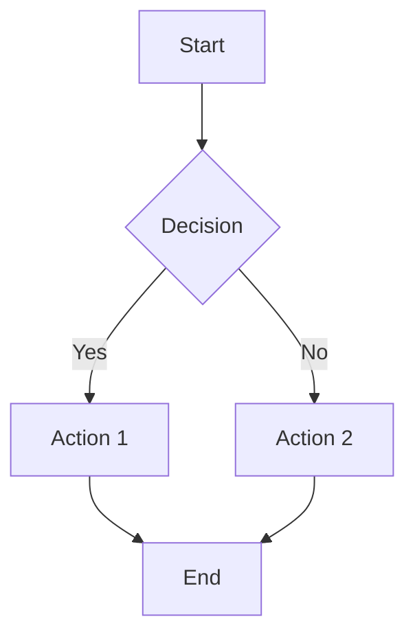
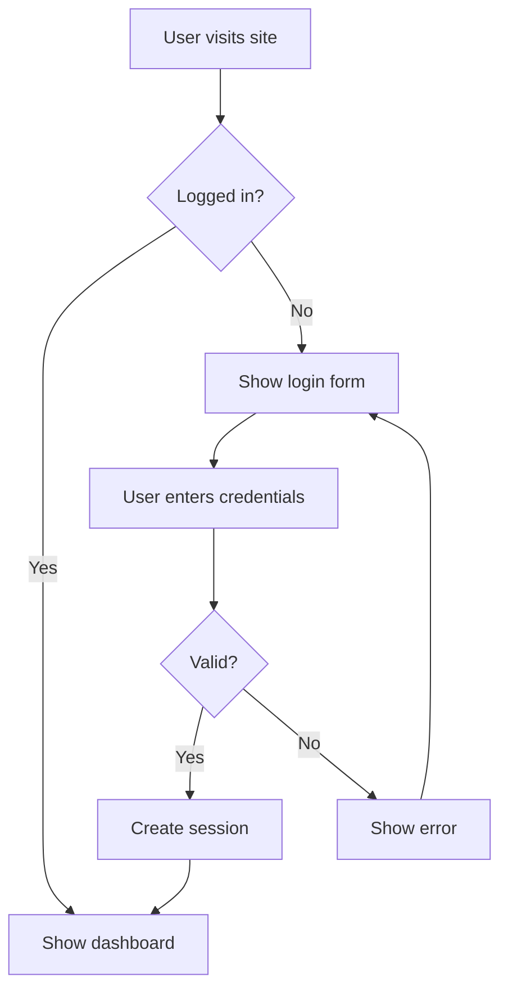

# Diagram Generator

This skill generates diagram images using draw.io (diagrams.net) via MCP and Playwright. It supports Mermaid syntax, CSV data, and draw.io XML format.

## Overview

The workflow is:
1. Create diagram definition (Mermaid, CSV, or XML)
2. Open it in draw.io viewer via MCP
3. Navigate to the URL with Playwright
4. Wait for rendering to complete
5. Take a screenshot and save as image

## Supported Formats

### Mermaid (Recommended)
Easiest and most reliable format. Supports:
- Flowcharts
- Sequence diagrams
- Class diagrams
- State diagrams
- Entity relationship diagrams
- Gantt charts
- And more

Example:


### CSV Format
Good for org charts and hierarchical diagrams.

Example CSV structure:
```csv
# label: %name%
# style: shape=%shape%;fillColor=%fill%;strokeColor=%stroke%
# identity: id
# parent: manager
# width: auto
# height: auto
# padding: 4
# ignore: id,shape,fill,stroke
# layout: auto
##
id,name,shape,fill,stroke,manager
1,CEO,ellipse,#dae8fc,#6c8ebf,
2,CTO,rectangle,#d5e8d4,#82b366,1
3,CFO,rectangle,#d5e8d4,#82b366,1
```

### XML Format
Advanced format for complex custom diagrams. Use Mermaid instead unless specific draw.io features are needed.

## Step-by-Step Instructions

### Step 1: Create the Diagram Definition

Ask the user what kind of diagram they want if not clear. For most cases, use Mermaid syntax as it's the most user-friendly.

If the user provides a description, translate it into Mermaid syntax. Mermaid is intuitive and supports many diagram types.

### Step 2: Open in draw.io Viewer

Use the appropriate MCP tool based on the format:

For Mermaid:
```
mcp__drawio__open_drawio_mermaid
- content: <mermaid syntax>
- lightbox: true
```

For CSV:
```
mcp__drawio__open_drawio_csv
- content: <csv data>
- lightbox: true
```

For XML:
```
mcp__drawio__open_drawio_xml
- content: <xml content>
- lightbox: true
```

**Important**: Always set `lightbox: true` for clean rendering without editing UI.

This will return a URL like:
`https://app.diagrams.net/?lightbox=1&edit=_blank&border=10#create=...`

### Step 3: Navigate with Playwright

Use `mcp__playwright__browser_navigate` to open the URL returned from Step 2.

### Step 4: Wait for Rendering

The diagram needs time to render. Wait 3 seconds:

```
mcp__playwright__browser_wait_for
- time: 3
```

This ensures the diagram is fully loaded before taking a screenshot.

### Step 5: Take Screenshot

Use `mcp__playwright__browser_take_screenshot`:

```
mcp__playwright__browser_take_screenshot
- type: png (or jpeg)
- filename: <descriptive-name>.png
- fullPage: true
```

**Important**: Set `fullPage: true` to capture the entire diagram, not just the viewport.

The image will be saved to the current working directory.

### Step 6: Inform the User

Tell the user where the image was saved and show them the result.

## Tips and Best Practices

1. **Use Mermaid first**: It's the most reliable and easiest to work with. Only use CSV or XML if the user specifically needs those formats or features.

2. **Descriptive filenames**: Use clear, descriptive filenames like `architecture-diagram.png` or `user-flow.png` rather than generic names.

3. **Diagram complexity**: For complex diagrams, Mermaid handles layout automatically. If the user needs precise control over positioning, XML format gives more control but requires more expertise.

4. **Colors and styling**: Mermaid supports styling via classDef. CSV supports inline styles. XML has full control over all visual properties.

5. **Iteration**: If the first attempt doesn't look right, ask the user what to adjust and regenerate. The process is fast.

6. **Multiple diagrams**: If the user needs multiple related diagrams, process them one at a time to avoid confusion.

## Common Use Cases

- **Architecture diagrams**: Use Mermaid flowcharts with custom shapes
- **Sequence diagrams**: Mermaid sequence syntax is perfect for this
- **Org charts**: CSV format with hierarchical parent relationships
- **Process flows**: Mermaid flowcharts with decision nodes
- **State machines**: Mermaid state diagrams
- **Data relationships**: Mermaid ER diagrams or class diagrams

## Example: Complete Workflow

User request: "Create a flowchart showing the user login process"

1. Create Mermaid syntax:


2. Call `mcp__drawio__open_drawio_mermaid` with the content and `lightbox: true`

3. Call `mcp__playwright__browser_navigate` with the returned URL

4. Call `mcp__playwright__browser_wait_for` with `time: 3`

5. Call `mcp__playwright__browser_take_screenshot` with `filename: "login-flow.png"` and `fullPage: true`

6. Tell user: "I've created the login flow diagram and saved it as `login-flow.png`"

## Error Handling

If the diagram doesn't render properly:
- Check the syntax (especially for XML)
- Try increasing wait time to 5 seconds
- For Mermaid errors, verify the syntax at mermaid.live first
- For CSV, ensure headers are properly formatted
- If XML shows "Not a diagram file" error, the XML structure is invalid - switch to Mermaid instead

## Limitations

- Requires both draw.io MCP server and Playwright MCP server to be configured
- Screenshot quality depends on browser rendering
- Very large diagrams may need longer wait times
- Interactive features of draw.io are not captured (output is static image)
