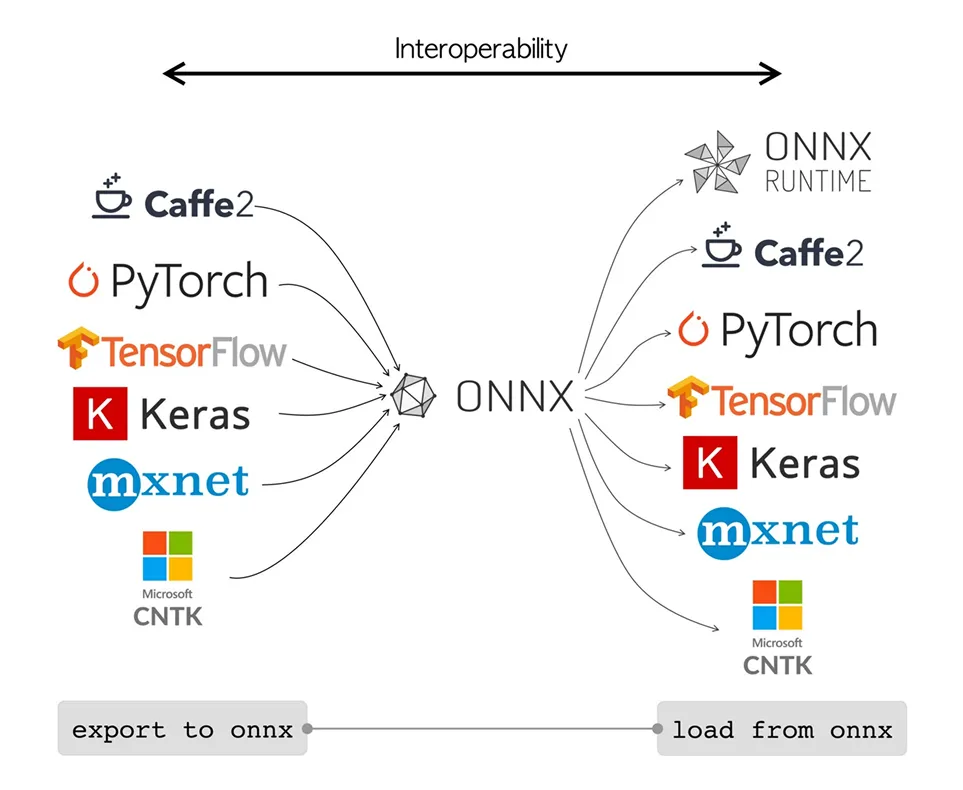

# 04 モデルのエクスポート・高速化

## このハンズオンで学ぶこと

- PyTorch モデル（`.pt`）を **ONNX 形式にエクスポート**する方法
- **Netron** でモデルの構造を可視化する
- **INT8 量子化**でさらに高速化・軽量化する
- （追加課題）用途・デバイスに合わせた別フォーマットへのエクスポート

> エクスポートとは何か・量子化・枝刈りなどの高速化手法については、スライドを参照してください。

---

## ONNX とは

**ONNX（Open Neural Network Exchange）** は、機械学習モデルの標準フォーマットを定義するオープンソースプロジェクトです。PyTorch や TensorFlow など、異なるフレームワークで学習したモデルを共通フォーマットに変換することで、フレームワークをまたいで利用できるようになります。



モデルは**計算グラフ**として表現され、各ノードが Conv・BatchNorm・ReLU などの演算を表します。このグラフ表現が統一されているため、ONNX Runtime や各種推論エンジンがフレームワークに依存せず高速に実行できます。

---

## ハンズオン手順

### 1. 環境のセットアップ

```bash
# 依存ライブラリをインストール（初回のみ）
uv sync
```

---

### 2. ONNX へのエクスポート

```bash
uv run python src/onnx-export.py
```

実行後、`src/` ディレクトリに `yolo26m-pose.onnx` が生成されます。

---

### 3. Netron でモデル構造を確認する

[https://netron.app](https://netron.app) にアクセスし、生成された `.onnx` ファイルをドラッグ＆ドロップしてください。

**確認してみよう：**

- モデルの入力・出力の形状（shape）はどうなっていますか？
- どんな演算ノード（Conv, BatchNorm, Relu など）が使われていますか？

---

### 4. 動作確認（Gradio デモで FPS を比較する）

`src/gradio-demo.py` は Webcam 映像でポーズ推定を実行し、FPS・推論時間をリアルタイムで表示するデモです。まず ONNX モデルを比較対象に追加します。

`src/gradio-demo.py` の `MODEL_FILES` を編集し、ONNX 行のコメントアウトを外してください。

```python
MODEL_FILES = {
    "PyTorch (.pt)": "yolo26m-pose.pt",
    "ONNX (.onnx)": "yolo26m-pose.onnx",  # コメントアウトを外す
}
```

デモを起動します。

```bash
uv run python src/gradio-demo.py
```

ブラウザが自動で開くので、ラジオボタンでモデルを切り替えながら FPS を比べてみましょう。PyTorch より ONNX の方が速くなっていますか？

---

### 5. INT8 量子化でエクスポート

`src/onnx-export.py` を編集して、INT8 量子化を有効にして再実行します。

```python
# 変更前
# half=True,

# 変更後（int8 量子化を有効化）
int8=True,
```

```bash
uv run python src/onnx-export.py
```

ファイルサイズが小さくなっていますか？ Netron で構造も見比べてみましょう。

---

### 6. 動作確認（量子化モデルの FPS を比較する）

`src/gradio-demo.py` の `MODEL_FILES` に量子化モデルも追加します。エクスポートしたファイルを `yolo26m-pose-quantized.onnx` にリネームしてから、コメントアウトを外してください。

```python
MODEL_FILES = {
    "PyTorch (.pt)": "yolo26m-pose.pt",
    "ONNX (.onnx)": "yolo26m-pose.onnx",
    "ONNX qint8 (.onnx)": "yolo26m-pose-quantized.onnx",  # コメントアウトを外す
}
```

```bash
uv run python src/gradio-demo.py
```

3つのモデルを切り替えて、FPS と精度の変化を確認してみましょう。

---

## 追加課題：別フォーマットにエクスポートしてみよう

Ultralytics は `format=` を変えるだけで様々なフォーマットにエクスポートできます。興味があれば試してみてください。

| フォーマット | 向いているデバイス | `format=` の値 |
|---|---|---|
| CoreML | Mac / iPhone / iPad（macOS のみ） | `"coreml"` |
| LiteRT (TFLite) | Android / 組み込みデバイス | `"tflite"` |
| OpenVINO | Intel CPU（要 `uv add openvino`） | `"openvino"` |

エクスポートしたファイルを Netron に読み込み、ONNX との構造の違いも観察してみましょう。

---

## 参考リンク

- [Ultralytics Export ドキュメント](https://docs.ultralytics.com/ja/modes/export/)
- [Netron（ブラウザ版）](https://netron.app)
