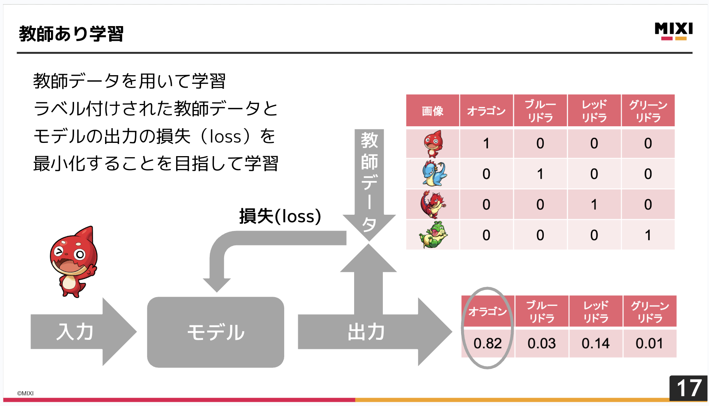
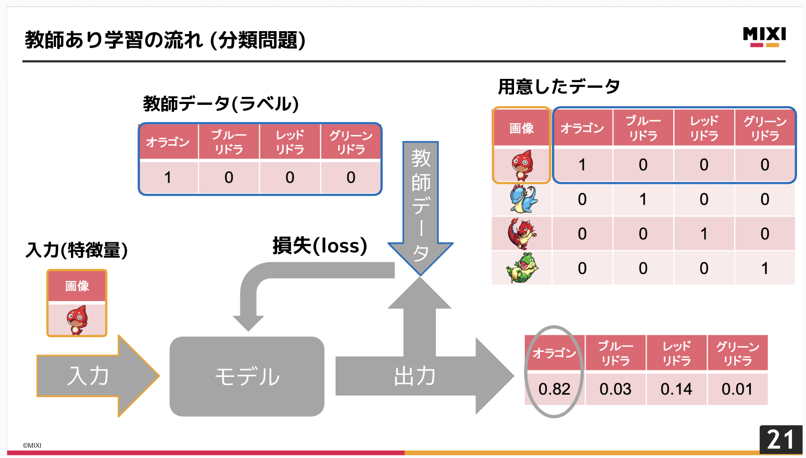
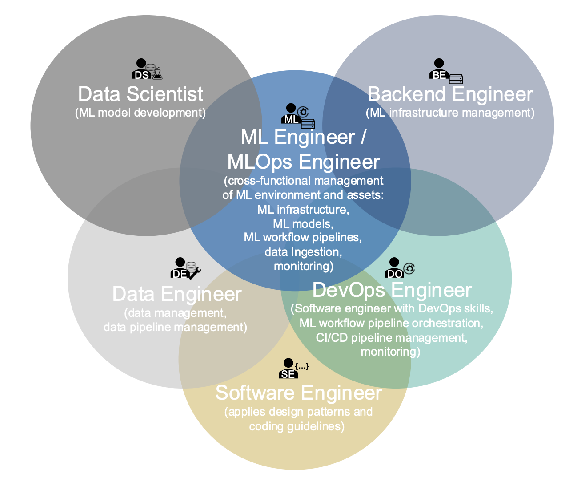

<!-- _class: title -->
<!-- _paginate: false -->

# 2026 新卒 AI 研修資料(1日目)

AIを支えるML技術の基礎知識編

---

# メタ情報

タイトルに「📄」が付いているスライドは、過去の資料を使用していることを示します。

Notion: [LINK](https://www.notion.so/familyalbum/AI-1-2ee2f9df7cab8027912cd69630230a83?t=3082f9df7cab804ebc0e00a9d5a2693f)
2025AI研修資料：[LINK](https://docs.google.com/presentation/d/1d-DrS9T4X9nsGQcaTBcT_PVuRRh7QTsojA-fV0N5gJQ/edit?slide=id.g2df1d0f91aa_1_193#slide=id.g2df1d0f91aa_1_193)

---
<!-- _class: section -->
<!-- _paginate: false -->

## Introduction

---

# 自己紹介：木内 貴浩

**木内 貴浩 / きのうち たかひろ / kittchy**

職種：MLエンジニア

みてね事業本部 みてねプロダクト開発部 Data Engineeringグループ

### 学生時代

- 大学院で音声認識の研究でML技術に触れる
- インターンシップなどで音声処理のML技術の研究開発

### 経歴

- 2024年4月 MIXI 新卒入社 🎉
- MLOpsに関する業務が経験がしたくて、「家族アルバム みてね」の事業部にジョイン
- 自然言語検索基盤の構築やMLレコメンド検索基盤の開発を行う

---

# AI/ML/DeepLearningの分類

### 人工知能 (Artificial Intelligence; AI)

- 人間のように「考える・判断する」コンピュータの技術全般
- 例：チェスAI、音声アシスタント、自動運転など

### 機械学習 (Machine Learning; ML)

- データから自動で学習して予測・判断する仕組み
- **AIを実現する中核技術**

### 深層学習 (Deep Learning)

- 大量のデータから複雑なパターンを学習できるML手法
- 画像認識、音声認識、自然言語処理で高精度を実現

---

# 例：ChatGPTで見るAI/ML/Deep Learningの関係

### 人工知能 (AI)

- 自然言語で対話できるアシスタントシステム全体
- UI、API、安全性フィルタ、インフラなどを含むサービス全体

### 機械学習 (Machine Learning)

- テキストデータから次の単語を予測するパターンを学習する技術
- LLM（Large Language Model）がこれに該当

### 深層学習 (Deep Learning)

- Deep Neural Networkを用いて構築したMLの学習
- 多層のニューラルネットワークで複雑なパターンを学習

---

# 今日学ぶこと：AI技術の基礎であるML

1. **基礎を理解して応用できる力を身につける**
    - 評価・運用の共通言語を習得し、新しい技術が出ても対応できる土台を作る

2. **自分でMLモデルを選別できるようになる**
    - 課題に対して適切なMLモデル・技術を評価し比較できるようになる

3. **様々なML技術を知る**
    - 画像認識、音声処理、推薦システムなど多様な技術の特性と使いどころを理解する

4. **ML技術をサービスに応用できるようになる**
    - 推論API化、デプロイ、運用まで一連の流れを体験し、実践的な知識を習得

---

# 1日目・2日目のゴール

### 1日目：ML基礎から運用まで

- MLの基本構造（教師あり）を理解する
- 推論・学習・高速化・API化まで一度つなげて体験する
- 評価・運用の共通言語を身につける（metric、閾値、監視など）

### 2日目：LLM/Agent/生成AI

- 生成AIの基礎を理解する（Transformer、Attention、LLMの構造など）
- 生成AIを用いたLLM/Agentの実践を体験する
- AI Agent の設計・評価・運用のサイクルを体験する

---

# 目次（今日やること）

1. 機械学習(ML)基礎
2. MLモデル推論
3. MLモデル学習
4. MLモデル高速化
5. デプロイ
6. MLモデルの評価と運用

---
<!-- _class: section -->
<!-- _paginate: false -->

## 1. 機械学習(ML)基礎

---

# 機械学習とは📄

### 「 過去のデータから知見を得て、それを次の決定に利用すること」

- **過去のデータ**：過去の状態・情報

- **知見**：ブラックボックスな関数 $f(x)$
  - 過去のデータには統計的なルールがあり、それを表す $f(x)$ を学習によりモデル化する

- **決定**：現在の状態 $(x)$ から未来 $(y)$ を予測する
  - 学習した知見を元に、未来の結果を予測する（$y = f(x)$）

---

# プログラミングとの違いは？📄

### プログラミング：ルールを自分で決めて表現する

- 盤面のスコアリングをルールベースで決定し、次のアクションの候補を評価して駒を動かす
- 例：「角が取れるなら取る」「王手を優先する」などのルールを人間が記述する

### 機械学習：過去のデータの中からルールを得る

- 大量の棋譜からパターンを見つけて、次の手を決定する
- 例：プロ棋士の対局データを学習し、盤面から最善手を予測する

---

# 統計との違いは？ 📄

### 統計：データからルールを得て、可視化して分析・説明する

- ある意思決定の理由を説明するのが目的

### 機械学習：データからルールを得て、目的のタスクの予測などに活かす

- 過去の統計情報をもとに、未来の情報を予測し、精度を上げていくことが目的

### データからルールを得るという部分は同じだが、基礎理論も同じ

→ **良いデータエンジニア/アナリストは良いMLエンジニア**

---

# 代表的な学習：教師あり学習

### データから最適な関数 $f$ を学習し、未知の入力 $\mathbf{x}$ に対して正確な予測 $\hat{y}$ を生成

- **入力** $\mathbf{x}$: モデルに渡す情報（画像/文章/特徴量など）のベクトル
- **正解** $y$: 当てたい答え（ラベル/数値など）
- **予測** $\hat{y}$: モデルが出す答え

$$\hat{y} = f(\mathbf{x})$$

この関数 $f$ のことを「モデル」と呼ぶ

### 例

- **画像分類**: $\mathbf{x}$ = 画像、$\mathbf{y}$ = 犬/猫、$\hat{\mathbf{y}}$ = 犬0.8 猫0.2
- **回帰**: $\mathbf{x}$ = ユーザ属性、$y$ = 購入金額、$\hat{y}$ = 予測金額

---

# 教師あり以外（今回は深入りしない）

実は教師あり学習の他にもありますが、今回の研修は理解しやすい **教師あり** を軸に進めます

- **教師なし学習**: 正解ラベルなしでデータの構造を見つける
  - クラスタリング・次元圧縮：顧客セグメンテーション、データ可視化、特徴量の前処理

- **強化学習**: 試行錯誤で報酬を最大化（正解は事前に与えられない）
  - ゲームAI（囲碁、チェス）、ロボット制御、推薦システムの最適化

- **半教師あり学習**: 少量のラベル + 大量の未ラベルデータを活用
  - 医療画像診断、音声認識など（ラベル付けコストが高い場合に有効）

- **自己教師あり学習**: データ自体から疑似ラベルを生成
  - 大規模事前学習（BERT、GPTなどLLMの基盤技術）

---

# Optional: 教師なし学習：クラスタリング 📄

### 正解ラベルなしでデータの構造を発見する

- **クラスタリング**：似たデータ同士をグループにまとめる
  - 例：顧客の購買データ → 「よく買うグループ」「たまに買うグループ」に自動分類

### 代表的なアルゴリズム

- **k-means**：k個のクラスタ中心を決め、各データを最も近い中心に割り当てる
  - メリット：シンプル・高速、デメリット：k を事前に決める必要がある
- **DBSCAN**：密度ベースでクラスタを形成（ノイズも検出可能）

### 使いどころ

- 顧客セグメンテーション、異常検知の前処理、データの可視化（次元圧縮 + クラスタリング）

---

# Optional: 強化学習 📄

### 試行錯誤で報酬を最大化する学習

- 正解ラベルが事前に与えられない点が教師あり学習と異なる
- **エージェント** が **環境** の中で **行動** し、**報酬** を受け取りながら方策を学習

### 基本要素

- **状態（State）**：現在の環境の情報（例：盤面の配置）
- **行動（Action）**：エージェントが取れる選択肢（例：駒を動かす）
- **報酬（Reward）**：行動の結果得られるスコア（例：勝利 +1 / 敗北 -1）

### 応用例

- **ゲームAI**：囲碁（AlphaGo）、Atariゲーム
- **ロボット制御**：歩行・把持の最適化
- **推薦システムの一部**：長期的なユーザ満足度を最大化する応用例

---

# 学習と推論

### 学習（Training）

- データから「入力→出力」のパターンを**学習** するフェーズ
  - 大量のデータを使って学習することで 「モデル」を構築する

### 推論（Inference）

- 学習済みモデルに新しい入力を与えて予測を返すフェーズ
  - 学習済みモデルを使って予測を出すことを「推論」と呼ぶ

### 今日の流れ

- まず「推論」を体験して共通構造を掴む → 次に「学習」の仕組みを理解する

---

<!-- _class: section -->
<!-- _paginate: false -->

## 2. MLモデル推論

---

# MLモデル推論の3つの共通フェーズ

### 1. Preprocess（前処理）

- あらゆる入力（テキスト/画像/音声…）を **tensor** (多次元配列) に変換
- 型・長さ・スケールを揃える（正規化など）

### 2. Model Forward（モデル計算）

- tensor をモデルに入れて、出力 tensor を得る
- 出力例：logits / embedding / boxes など

### 3. Postprocess（後処理）

- 出力 tensor を **タスクに適した形にデコード**
- デコード例：ラベル、座標、文字列、スコアなど

---

# テーブルデータ：ハンズオン概要

### タスク：Iris分類（NN & 勾配ブースティング）

- **やること**

  - Irisの特徴量（4次元）から3クラス分類（Setosa, Versicolor, Virginica）
  - **2つのアプローチで推論を比較**
    - Neural Network（全結合NN）
    - [Optional] 勾配ブースティング（LightGBM）

- **確認ポイント**

  - **前処理の違い**：標準化の有無で精度がどう変わるか
  - **クラス確率**：各クラスの予測確率を確認
  - 入力1件とバッチ入力で推論を実行

---

# テーブルデータ詳細：Preprocess（前処理）

### 表形式データをモデル入力に変換

1. **欠損値処理**
   - 補完（平均値/中央値/特定値）または欠損フラグ

2. **カテゴリ特徴量**
   - One-hot / Ordinal / Target encoding

---

# テーブルデータ詳細：Forward（モデル計算）

### Neural Network

- 全結合層（Dense/Linear）の積み重ね
- 活性化関数（ReLU, GELUなど）
- 例：`Input(4) → Dense(16, ReLU) → Dense(8, ReLU) → Dense(3)`
- 出力：**logits**（未正規化スコア）

### [Optional] 勾配ブースティング

- 決定木のアンサンブルで推論
- LightGBM / XGBoost / CatBoost
- 出力：**predict_proba**（クラス確率）

---

# テーブルデータ詳細：Postprocess（後処理）

### 確率からクラスラベルへの変換

1. softmax で確率化：`logits → 確率`
2. argmax でクラス選択
3. 閾値フィルタ（オプション）

---

# テーブルデータ：評価指標①

### Accuracy

- 全体の正解率
- クラスバランスが良い場合に有効
- 例：150件中140件正解 → Accuracy = 93.3%

### 混同行列（Confusion Matrix）

- どのクラスをどのクラスと間違えたかを可視化
- 例：Versicolor と Virginica を間違えやすい → 特徴量が似ているため

### モデル固有の分析

- NN：学習曲線（train/valid loss）で過学習を検出
- ブースティング：特徴量重要度で寄与を確認

---

# テーブルデータ：評価指標②

### Precision（適合率）

- 「モデルが陽性と予測したもの」のうち、実際に陽性だった割合
- 高い → **誤検知（FP）が少ない**

### Recall（再現率）

- 「実際に陽性のもの」のうち、モデルが正しく検出できた割合
- 高い → **見逃し（FN）が少ない**

### F1スコア

- Precision と Recall の調和平均 → どちらかだけ高くても上がらない

### 平均の種類

- **macro平均**：各クラスを同等に扱う（少数クラスも重視）
- **micro平均**：全サンプルを同等に扱う（多数クラスが支配的）
- クラス不均衡がある場合は macro を見るのが重要

---

# NLP：ハンズオン概要

### タスク：Sentiment Analysis（感情分析）

- **やること**
  - 文章全体にポジティブ/ネガティブのラベルを付ける
  - 例：「私はとっても幸せ」→ ポジティブ、「私はとっても不幸」→ ネガティブ
- **モデル**: `tabularisai/multilingual-sentiment-analysis`
  - 多言語対応のBERT系モデルで、文章全体の特徴を捉えて分類する

参考
[Text classification](https://huggingface.co/docs/transformers/ja/tasks/sequence_classification)
[tabularisai/multilingual-sentiment-analysis](https://huggingface.co/tabularisai/multilingual-sentiment-analysis)

---

# NLP詳細：Preprocess（前処理）

### 文章を固定長テンソルに変換

1. **Tokenizerで分割**
   - 例：「このレストランは最高でした！」 → `["この", "レストラン", "は", "最高", "でした", "！"]`

2. **数値IDに変換**
   - トークン → 語彙辞書で数値化 → `input_ids`

3. **長さ調整**
   - `padding` / `max_length` / `attention_mask`

---

# NLP詳細：Forward（モデル計算）

### Sentiment Analysisの推論

1. **入力**

    - `input_ids` + `attention_mask`

2. **モデル処理**

    - BERT系モデルで文章全体の特徴を抽出

3. **出力**

    - **logits**：`(batch, num_labels)`
      - 文章全体の各ラベルに対するスコア
      - 例：`(1, 2)`（ポジティブ/ネガティブの2ラベル）

---

# NLP詳細：Postprocess（後処理）

### logits からラベルへの変換

1. **softmax で確率に変換**
   - logitsを確率分布に変換
   - 例：`[3.2, -1.5]` → `[0.99, 0.01]`

2. **argmax でラベルID取得 → ラベル名にマッピング**
   - 最大確率のラベルを選択
   - 例：`[0.99, 0.01]` → ポジティブ（99%）

---

# NLP：評価指標

Sentiment Analysis（感情分析）では、**文章全体の分類が正しいかを評価**します。

**評価例：**

```
文章: 「料理が美味しかった」→ 正解: ポジティブ, 予測: ポジティブ ✅
文章: 「サービスが最悪」  → 正解: ネガティブ, 予測: ネガティブ ✅
文章: 「まあまあだった」  → 正解: ネガティブ, 予測: ポジティブ ❌
文章: 「また行きたい」   → 正解: ポジティブ, 予測: ポジティブ ✅
```

**Accuracy: 75%（3/4文章正解）**

---

# NLP：評価指標の使い分け

### 2値分類での Precision / Recall の意味

| | 予測: ポジティブ | 予測: ネガティブ |
|---|---|---|
| **正解: ポジティブ** | TP（正しく検出） | FN（見逃し） |
| **正解: ネガティブ** | FP（誤検知） | TN（正しく棄却） |

### タスクによって重視する指標が変わる

- **スパム判定**: Precision重視 → 正常メールを誤ってスパムにしたくない
- **医療診断**: Recall重視 → 病気の見逃しを防ぎたい
- **感情分析**: F1（バランス型）→ どちらの誤りも同程度に重要

### Accuracyだけでは不十分な例

- ネガティブが全体の5%しかない場合、「全部ポジティブ」と予測するだけでAccuracy 95%

---

# 画像：ハンズオン概要

### タスク：Object Detection（物体検出）

- **やること**

  - 画像から複数の物体を検出（bbox + クラスラベル）
  - 例：犬、猫、人などの物体を検出
    - 各物体の位置（bbox）とクラスを予測

参考：[Object detection](https://huggingface.co/docs/transformers/ja/tasks/object_detection)

---

# 画像詳細：Preprocess（前処理）

### 画像をテンソルに変換

1. **resize（サイズ調整）**
   - モデルの入力サイズに合わせる
   - 例：`(640, 480)` → `(800, 800)`

2. **normalize（正規化）**
   - ピクセル値を標準化
   - 例：`[0, 255]` → `[-1, 1]`

3. **テンソル化 + サイズ保持**
   - `pixel_values`：`(batch, channels, H, W)`
   - 元画像サイズを保持（後処理で座標変換に使用）

---

# 画像詳細：Forward（モデル計算）

### Object Detectionの推論

**入力**

- `pixel_values`：正規化済み画像テンソル

**モデル処理**

- DETR系 / YOLO系で物体検出

**出力（3つ）**

1. **bbox座標**：`(x, y, w, h)` または `(x1, y1, x2, y2)`
2. **class logits**：各クラスのスコア
3. **confidence**：検出の確信度（0〜1）

---

# 画像詳細：Postprocess（後処理）

### 検出結果を使いやすい形に変換

1. **座標変換**
   - モデル出力座標 → 元画像座標にスケール変換
   - 例：`(400, 400)` → `(1920, 1080)`

2. **confidence閾値フィルタ**
   - 低確信度の検出を除去
   - 例：`confidence < 0.5` を削除

3. **NMS（Non-Maximum Suppression）**
   - 重複bboxを除去（IoU閾値で判定）
   - ※DETR系は内部でNMS済みのことも

---

# 画像：評価指標

### Object Detectionの評価

**mAP（mean Average Precision）**

- 複数のIoU閾値で評価した平均精度
- 例：COCO mAP@[.50:.95]（IoU 0.5〜0.95で10段階）

**AP50 / AP75**

- **AP50**：IoU ≥ 0.5 での精度（緩い基準）
- **AP75**：IoU ≥ 0.75 での精度（厳しい基準）

**IoU（Intersection over Union）**

- 予測bboxと正解bboxの重なり度合い（0〜1）
- 高いほど精度が良い

---

# 画像：評価指標の直感

### IoUの直感的な理解

- IoU = 0.0：予測bboxと正解bboxが全く重なっていない
- IoU = 0.5：半分くらい重なっている → **AP50の基準（緩い）**
- IoU = 0.75：かなり正確に重なっている → **AP75の基準（厳しい）**
- IoU = 1.0：完全一致

### mAPの読み方

- **mAP@0.5（AP50）**: 「だいたい合ってるか」→ 物体の検出漏れを見る
- **mAP@[.50:.95]**: 「位置まで正確か」→ bbox精度を含めた総合評価
- 実務では用途によって閾値を使い分ける
  - 「物体があるかないか」だけなら AP50 で十分
  - 位置精度が重要（自動運転等）なら AP75 以上が必要

---

# [Optional] 音声：ハンズオン概要

### タスク：ASR（自動音声認識）

- **やること**

  - 日本語音声をテキストに書き起こす
  - 例：「今日の天気は晴れです」という音声 → `"今日の天気は晴れです"`

- **モデル**: `openai/whisper-small`
  - OpenAI が開発した多言語対応の ASR モデル
  - encoder-decoder 構造（音声 → 内部表現 → テキスト）

参考：[Automatic Speech Recognition](https://huggingface.co/docs/transformers/ja/tasks/asr)
/ [openai/whisper-small](https://huggingface.co/openai/whisper-small)

---

# [Optional] 音声詳細：Preprocess（前処理）

### 音声を log-mel spectrogram に変換

1. **resample（サンプリングレート調整）**
   - Whisper の期待するレートに変換
   - 例：`48kHz` → `16kHz`

2. **log-mel spectrogram に変換**
   - `AutoFeatureExtractor` で時間×周波数の2次元表現に変換
   - shape：`(1, 80, 3000)` ← 80 mel 帯域 × 30 秒分

3. **可視化**
   - spectrogram を画像として表示 → 音声の形が「見える」

---

# [Optional] 音声詳細：Forward（モデル計算）

### Whisper の encoder-decoder 構造

```
[log-mel spectrogram]  (1, 80, 3000)
        ↓
[Encoder（CNN + Transformer）]
        ↓
[encoder hidden states]  (1, 1500, hidden_size)
        ↓
[Decoder（Transformer + 自己回帰生成）]
        ↓
[token ids]  (1, seq_len)
```

- **Encoder**：音声特徴量 → 内部表現（並列処理）
- **Decoder**：内部表現 → トークンを1つずつ生成（自己回帰）

---

# [Optional] 音声詳細：Postprocess（後処理）

### token ids からテキストへの変換

1. **token id → サブワード変換**
   - 語彙辞書でIDを文字列に変換

2. **特殊トークンを除去**
   - `<|startoftranscript|>`, `<|ja|>`, `<|endoftext|>` などを削除

3. **テキストに結合**
   - サブワードを連結して最終的な文字列を生成

---

# [Optional] 音声：評価指標

### WER（Word Error Rate）

英語などの分かち書き言語で標準的な指標。

```
WER = (S + D + I) / N
  S: 置換（substitution）
  D: 削除（deletion）
  I: 挿入（insertion）
  N: 正解の単語数
```

### CER（Character Error Rate）

日本語に適した指標。文字レベルで WER と同様に計算する。

```
正解: 今日は晴れです     （7文字）
予測: 今日は晴れでした   （8文字）
CER = 編集距離 2 / 7 ≈ 28.6%
```

参考：[WER の解説](https://huggingface.co/spaces/evaluate-metric/wer) / [jiwer ドキュメント](https://jiwer.readthedocs.io/en/latest/)

---

# [Optional] 音声：評価指標の具体例

### WER の計算例

```
正解: the cat sat on the mat    （6単語）
予測: the cat sit on a mat
  → 置換(S): sat→sit = 1
  → 置換(S): the→a   = 1
  → WER = 2 / 6 ≈ 33.3%
```

### CER の計算例（日本語）

```
正解: 東京都渋谷区     （6文字）
予測: 東京と渋谷区
  → 置換(S): 都→と = 1
  → CER = 1 / 6 ≈ 16.7%
```

### ポイント

- WERは英語向き、CERは日本語向き（分かち書きの影響を受けない）
- CER = 0% が理想だが、固有名詞・専門用語は誤りやすい
- 実務では **ドメイン特化の辞書追加** や **言語モデルの調整** で改善する

---

# 評価指標はタスクごとに異なる

### 今回紹介した指標は代表例にすぎない

| タスク | 紹介した指標 | 他にもある指標の例 |
|--------|------------|-------------------|
| 画像分類 | Accuracy, Precision, Recall | F1-Score, AUC-ROC, Top-k Accuracy |
| 物体検出 | IoU, mAP | AP@50, AP@75, FPS（速度） |
| テキスト分類 | Accuracy, F1 | MCC, Cohen's Kappa |
| 音声認識 | WER, CER | SER（文単位誤り率）, BLEU |

### 指標選びのポイント

- **ビジネス要件**で最適な指標は変わる（例：医療なら Recall 重視、スパム検知なら Precision 重視）
- **生成AI（LLM・画像生成など）**では評価指標自体がまだ研究途上
  - 人間評価、LLM-as-a-Judge、BLEU/ROUGE など多様なアプローチが共存
- 論文やベンチマーク（Papers with Code など）を読んで、自分のタスクに合った指標を調査しよう
- 適切な評価指標の選択がプロジェクトの成否を左右する → **セクション6** で詳しく扱います

---

<!-- _class: section -->
<!-- _paginate: false -->

## ちょっと一息：回帰と分類

---

# 教師あり学習：分類と回帰

### 2つのタスクタイプ

- **分類（Classification）**: クラス（ラベル）を当てる
  - 出力は離散値：犬/猫、True/False、クラスA/B/Cなど

- **回帰（Regression）**: 連続値を予測する
  - 出力は連続値：金額、温度、人数など
  - 数字の大小に意味がある

※どちらも「出力（=予測）をどう解釈するか」と「どう評価するか」がセット

---

# 分類（Classification）とは

### クラスラベルを予測するための分類

**出力が離散値**

- True/False、犬、猫、人...

**データに与えられたクラス（カテゴリ）を予測する際に使用**

**例：画像分類**

- 画像や特徴から、その画像が何のクラスに属するかを予測
- 2値分類：スパムメール判定（スパム/正常）
- 多クラス分類：犬の種類判定（柴犬: 0.1, プードル: 0.8, ブルドッグ: 0.1）

---

# 回帰（Regression）とは

### 連続値を予測するための回帰

**出力が連続値**

- 金額、人数、温度、売上、年齢...

**数字の大小に意味が存在する値を予測する際に使用**

**例：売上予測**

- 過去のデータから未来の売上を予測
- 線形回帰：特徴量から目標値を予測
- 時系列予測：過去の時系列データから未来を予測

---

# ワーク：回帰？分類？

1. ユーザの収入や家族構成、その他パラメータから預金額を予測する
2. ユーザの収入や家族構成、その他パラメータからある取引が不正かどうかを予測する
3. 画像に写っている物の種類を予測する
4. 画像に写っている物の位置を予測する

---
<!-- _class: section -->
<!-- _paginate: false -->

## お昼休憩

---

<!-- _class: section -->
<!-- _paginate: false -->

## 3. MLモデル学習

---

# 教師あり学習とは

### 教師データを用いて学習する仕組み

- ラベル付けされた教師データとモデルの出力の損失（loss）を最小化することを目指して学習
- 入力 $\mathbf{x}$ → モデル $f$ → 出力 $\hat{y}$ と正解 $y$ を比較



---

# 教師あり学習の流れ（分類問題の具体例） 📄

### 具体的なデータフロー



**ポイント**

- 教師データ（ラベル）から損失を計算
- 損失を小さくする方向にパラメータを更新
- これを繰り返すことでモデルが学習

---

# 層（Layer）とは何か

**一言で**: tensor を別の tensor に変換する部品。

### 典型形

- **線形変換**: $y = Wx + b$
- **活性化（非線形）**: ReLU/GELU など

### なぜ層を重ねる？

- 1層だけだと表現できる関数が限られる
- 層を重ねると、線形から非線形タスク(より複雑)に対応しやすくなる

---

# パラメータ（Weight & Biases）📄

**一言で**: モデルが学習で獲得する数値。層の中にある。

### どこにある？

- 線形層：$W$ と $b$
- 畳み込み層：フィルタ（カーネル）

### パラメータ数が増えるとどうなる？

- 表現力は上がりやすい
- ただしデータが少ないと過学習しやすい
- 推論コスト（速度/メモリ）も増える

### 直感

- 「覚える量」を増やすと当てられるようになるが、覚えすぎると未知に弱い

---

# Loss（損失）とは何か（目的関数）

**一言で**: 予測 $\hat{y}$ と正解 $y$ のズレを数値化したもの。

- 学習は「loss を下げる」問題になる

### 分類の代表：Cross Entropy

- logits → softmax → 確率
- 正解クラスの確率を上げるほど loss が下がる

### 回帰の代表：MSE / MAE

- 予測と正解の距離を測る

### 重要

- metric（Accuracy等）は評価用
- loss は学習で直接最適化する対象

---

# Lossが「パラメータ更新」につながる流れ

### 流れ（数式なし）

1. 入力を入れて forward して予測を出す
2. 予測と正解から loss を計算する
3. loss を小さくする方向にパラメータを少しだけ動かす（勾配降下:最適化関数）
4. これをミニバッチで繰り返す

### 学習率（lr）

- 1回の更新でどれだけ動かすか
- 大きすぎると発散、小さすぎると進まない

### 見るべきサイン

- train loss が下がっているか
- valid loss が悪化し始めていないか（過学習）

### ミニバッチとは

- 全データを一度に使わず、小さな塊（例：32, 64, 128サンプル）に分けて学習
- **メリット**：メモリ効率が良い、汎化性能が上がる
- **デメリット**：更新がノイジーになる（学習率の調整が必要）

---

# Optional: 最適化関数📄

### 代表的な最適化アルゴリズム

- **SGD（確率的勾配降下法）**：基本的な手法
  - シンプルで理解しやすい

- **Adam**：学習率を自動調整、収束が速い
  - **実務でよく使われる**（迷ったらこれ）

- **AdamW**：Adamに正則化を追加
  - Transformerなど大規模モデルで人気

---

# 評価指標（metric）と目的関数（loss）の違い

- **metric**: 人間が「良いモデルか」を判断するための指標（例：Accuracy/F1/mAP/MAE）
- **loss**: 学習で直接最小化する数式（例：Cross Entropy/MSE）

### 重要

- いつも metric と loss は一致しない
- だから「何を良しとするか」を先に決める必要がある

---

# ミニ演習：タスク → metric → loss を対応づける

次の表を埋めてください（5分）。

- タスク：分類 / 回帰 / 検出 / セグメンテーション
- 代表metric：？
- 代表loss：？

### ヒント

- 分類：Accuracy や F1、loss は Cross Entropy が定番
- 回帰：MAE/MSE、loss は MSE/MAE が定番

---

# ハンズオン：Iris分類 (全結合NN)📄

### やること

- Irisデータセットで全結合NNを **PyTorchで学習** する
- train/valid の loss・Accuracy の学習曲線をプロットして観察する
- epoch数・学習率を変えて、過学習の兆候を確認する

### ゴール

- 学習ループ（forward → loss → backward → step）の流れを体験する
- 学習曲線から「いつ止めるべきか」を自分で判断できるようになる

---

# データ分割（train / valid / test）とリーク📄

### 目的

学習したモデルが「未知データでも当たるか」を正しく測る。

- **train**: 学習に使う
- **valid**: ハイパーパラメータ調整やモデル選択に使う
- **test**: 最後に1回だけ、最終成績の確認に使う

### データリーク（Leak）

- 未来情報や答えに近い情報が、学習や評価に混ざってしまうこと
- 例：
  - 予測したい時点より後のデータを特徴量に入れる
  - ユーザ単位で分けるべきなのに、同一ユーザがtrainとtestに混ざる

---

# 過学習（Overfitting）と学習曲線📄

### 症状

- train は良くなるが valid が頭打ち/悪化する
- 訓練データを「覚えた」状態で、未知データに弱い

### 見るもの（最低限）

- train/valid の loss
- train/valid の指標（例：Accuracy）

### 対策（どれか1つでOK）

- 早期終了（Early Stopping）
- 正則化（weight decay / dropout）
- データ拡張（画像なら回転・cropなど）

---

# ハンズオン：意図的に過学習 → 対策📄

### 過学習を起こす例

- データを減らす
- モデルを大きくする
- エポックを増やす

### 対策を1つ入れる

- early stopping / 正則化 / データ拡張

### ゴール

- train/valid の学習曲線の差が縮むことを確認

---

# 拡張課題：学習曲線の比較📄

同じコードでパラメータだけ変えて、曲線の形の違いを見る。

- 学習率（lr）
- 正則化強度（weight decay）
- データ量

### 比較観点

- 収束の速さ
- 過学習開始のタイミング
- 最終 valid 指標

---

# 転移学習の実務パターン📄

**狙い**: 事前学習済みモデルを土台にして、少ないデータでも高性能を狙う。

### 基本パターン

- **ヘッド差し替え**: 最後の層を目的クラス数に置き換える
- **凍結/解凍**:
  - まず backbone を凍結してヘッドだけ学習
  - 次に一部/全部を解凍して微調整
- **学習率**: 解凍後は小さくするのが基本
- **データ拡張**: 特に少量データで効く

---

# ハンズオン：CNNの転移学習📄

### やること

- 事前学習済みCNN（例：ResNet）で転移学習する
- freeze → head学習 → unfreeze → fine-tune を体験する

### 拡張課題

- 凍結範囲の差分（headのみ / 後半ブロックのみ / 全部）
- 学習率の差分

### 評価指標（最小セット）

- Accuracy（必要なら Precision/Recall/F1）

---

<!-- _class: section -->
<!-- _paginate: false -->

## 4. MLモデル高速化

---

# MLモデル高速化の全体像

### なぜ高速化が必要か

- **レイテンシ**：リアルタイム応答が必要（例：チャット、音声認識）
- **スループット**：大量処理が必要（例：バッチ推論）
- **コスト削減**：GPU/CPU使用料を減らす
- **エッジデプロイ**：スマホ・IoTなど制約のある環境で動かす

### 高速化の3つのアプローチ

1. **モデル変換**：軽量なフォーマットに変換（ONNX等）
2. **精度削減**：FP16/INT8で計算量を減らす
3. **構造最適化**：Pruning、蒸留でモデルを小さくする

---

# モデル変換（export）をやる理由

**一言で**: 学習用のコードと、推論用の実行物は分ける。

### 目的

- **実行環境を揃える**: Python前提 → アプリ/サーバ/エッジなどに載せる
- **依存性を減らす**: 学習フレームワークや周辺ライブラリに縛られない
- **最適化の入口にする**: コンパイル、融合、量子化などを適用しやすくする
- **配布しやすくする**: 成果物（モデル）をチーム/サービス間で受け渡しやすい

### 学習と推論の分離

- **学習**：PyTorch/TensorFlowで柔軟に開発
- **推論**：ONNX/TFLiteで最適化＆デプロイ

---

# なぜPyTorchモデルをそのまま推論に使いにくいか？

### PyTorchはEager Mode（動的計算グラフ）

- `forward()` を呼ぶたびにPythonで計算グラフが**動的に構築**される
- グラフが事前に固定されないため、静的最適化（カーネル融合等）が困難

### Autograd情報が残っている

- 学習用の勾配計算グラフ（backward用情報）が含まれる
- 推論には不要だが、メモリを消費する

### Python依存

- Pythonインタープリタが必要 → C++/Java/モバイル環境では動かしにくい

### → 推論専用フォーマットに変換して解決

- export時に計算グラフをトレース・固定化してAOT（事前コンパイル）形式に変換
- ※ `torch.no_grad()` や `torch.compile()` である程度緩和できるが、Python依存は残る

---

# 代表手段：ONNX

**ONNX**: モデルをフレームワーク非依存の形式にする規格。

- `torch.onnx.export` でPyTorchの動的グラフを**静的グラフに変換**して保存
  - Pythonのcontrol flow・data structureを除去してAOT形式に固定化
- 実行は **ONNX Runtime**（CPU/GPU）などで行う

### 嬉しいこと

- 推論環境が作りやすい（特にPython以外）
- 最適化（Graph最適化、融合、量子化）を適用しやすい

### 注意点（ハマりどころ）

- exportできない演算（op）や dynamic shape
- 前処理/後処理がモデル外にあると、性能/互換で詰まりやすい

---

# エクスポートフォーマット比較

| フォーマット | 向いている環境 | 強み | 弱み |
|---|---|---|---|
| **ONNX** | CPU/GPU 汎用 | 汎用性最高・ツール充実 | 未対応opあり |
| **TorchScript** | Python/C++ | PyTorchネイティブ | 最適化の余地少 |
| **CoreML** | Mac/iPhone/iPad | Appleシリコン最適化 | Apple環境のみ |
| **TFLite** | Android/組込み | 軽量・省電力 | TF経由で変換が必要 |
| **OpenVINO** | Intel CPU | Intel CPU最適化（CPU比2-3x） | Intel環境のみ |
| **TensorRT** | NVIDIA GPU | 最速GPU推論（GPU比2-5x） | NVIDIA GPUのみ |

参考: [Ultralytics Export Formats](https://docs.ultralytics.com/ja/modes/export/)

---

# ハンズオン：ONNXに変換して推論してみる

### やること

```bash
uv run python src/onnx-export.py  # → yolo26m-pose.onnx を生成
uv run python src/gradio-demo.py  # → Gradio デモでFPSを比較
```

- **Netron** でモデル構造を可視化（[netron.app](https://netron.app)）
- `gradio-demo.py` の `MODEL_FILES` の `"ONNX (.onnx)"` 行のコメントアウトを外す

### 見る観点

- PyTorchとONNX Runtimeの推論時間・FPS差
- Netronで入出力のshapeやノード構成（Conv/BatchNorm/ReLU等）を確認
- 同一入力での出力差分（精度が変わっていないか）

---

# 高速化手法①：半精度（FP16 / BF16）

**FP32（32bit浮動小数点）→ FP16（16bit）に変換してメモリ・速度を改善**

- メモリ使用量が**約半分**に削減
- NVIDIA Tensor Core等のGPUで特に効果大
- 精度劣化は多くの場合小さい

### BF16（BrainFloat16）との違い

| 形式 | 指数部 | 仮数部 | 特徴 |
|---|---|---|---|
| FP32 | 8bit | 23bit | 標準 |
| FP16 | 5bit | 10bit | GPU推論向け・オーバーフローに注意 |
| BF16 | 8bit | 7bit | FP32と同じ指数部でオーバーフロー防止 → LLMでよく使われる |

### ハンズオンでの適用

```python
model.export(format="onnx", half=True)  # FP16でエクスポート
```

---

# 高速化手法②：量子化（Quantization）とは

**浮動小数点(FP32)を整数(INT8など)で近似する手法**

- INT8: 8bit整数（-128〜127）で表現 → **メモリ約1/4、CPU推論で高速化**
- `scale`（スケール）と `zero_point`（ゼロ点）で量子化・逆量子化（近似誤差は発生）

$$x_{\text{INT8}} = \text{round}\!\left(\frac{x_{\text{FP32}}}{\text{scale}}\right) + \text{zero\_point}$$

### 2種類の量子化

| 種類 | 特徴 | 使用場面 |
|---|---|---|
| **動的量子化** | 重みを事前量子化、activationは実行時に動的に量子化 | 手軽・精度影響小 |
| **静的量子化** | calibrationデータでactivationも事前量子化 | より高速・精度は要確認 |

**ハンズオンで使うのは「動的量子化」**

---

# 高速化手法③：枝刈り（Pruning）とは

**重要度の低い重み・ニューロン・フィルタを削除してモデルを軽量化する手法**

### 2種類のPruning

- **Unstructured Pruning（非構造的）**
  - 個々の重みをゼロに（スパース化）
  - 専用ハードウェアのスパース演算サポートが必要

- **Structured Pruning（構造的）**
  - チャネルや層全体を削除
  - 実際の推論速度改善に直結しやすい

---

# ハンズオン：モデルの量子化（INT8）

### やること

```bash
uv run python src/onnx-qint8-export.py  # → yolo26m-pose-quantized.onnx を生成
uv run python src/gradio-demo.py         # → 3モデルでFPSを比較
```

`gradio-demo.py` の `MODEL_FILES` に量子化モデルを追加してFPSを3モデルで比較

### 見る観点

1. **速度改善**：PyTorch → ONNX FP32 → INT8でどれくらい速くなったか
2. **精度影響**：同一入力で出力差分をチェック
3. **モデルサイズ**：ファイルサイズがどう変わったか（約75%削減が目安）

---

# Optional: 他のエクスポートフォーマットを試す

Ultralyticsは `format=` を変えるだけで様々なフォーマットに対応

```python
from ultralytics import YOLO
model = YOLO("yolo26m-pose.pt")

model.export(format="coreml")    # Mac/iPhone/iPad向け（macOSのみ）
model.export(format="tflite")    # Android/組込みデバイス向け
model.export(format="openvino")  # Intel CPU向け（要 uv add openvino）
```

### 各フォーマットで確認してみよう

- Netronに読み込んで、ONNXとの構造の違いを観察
- `gradio-demo.py` に追加してFPSを比較
- 精度が変わっていないかを確認（同一入力で出力差分チェック）

参考: [Ultralytics Export ドキュメント](https://docs.ultralytics.com/ja/modes/export/)

---

<!-- _class: section -->
<!-- _paginate: false -->

## 5. デプロイ

---

# 設計：モデルとコンテナを分離する

**MLOpsの定石**：モデルファイルをコンテナに含めない。

### なぜ分離するか

- モデルを更新するたびにコンテナを再ビルドしなくて済む
- モデルのバージョン管理（GCS）とコンテナのバージョン管理（Artifact Registry）を独立させられる

### 07-model-deploy の設計

- 環境変数 `MODEL_GCS_URI` でモデルの場所を指定
- サーバ起動時（`lifespan`）に GCS からモデルをダウンロード
- `/health` → モデルロード完了まで 503 を返す（Vertex AI が待ってくれる）

---

# ハンズオン：Vertex AI デプロイ（07-model-deploy）

**ゴール**: 06で作ったYOLO（ONNX）を FastAPI + カスタムコンテナで Vertex AI にデプロイする。

### ステップ概要

- **Step 0**: モデルを GCS にアップロード
- **Step 1**: `src/app.py` / `src/predictor.py` を確認
- **Step 2**: ローカルで Docker テスト（`curl /health`, `/predict`）
- **Step 3**: Artifact Registry にコンテナを push
- **Step 4**: Vertex AI にモデル登録 → エンドポイント作成 → デプロイ
- **Step 5**: エンドポイントへの推論テスト（`notebook.py`）
- **Step 6**: A/B テスト（v2 を 20% にトラフィック分割）

---

# Vertex AI とは

**Google Cloud（GCP）が提供する ML プラットフォーム**。
モデルの開発・デプロイ・運用に必要な機能をまとめて提供する。

### 位置づけ

- 単なるデプロイ基盤ではなく、ML ライフサイクル全体をカバー
- フルマネージド（インフラ管理不要）でスケール・監視・ロールバックが可能

### このハンズオンで使っている部分

- **Artifact Registry**：コンテナイメージの保存
- **Vertex AI Model Registry**：モデルのバージョン管理
- **Vertex AI Endpoint**：推論 API のホスティング

---

# Vertex AI でできること

| 機能 | 内容 |
|---|---|
| **モデル学習** | カスタムコンテナ or AutoML で学習ジョブを実行 |
| **ハイパーパラメータ探索** | Vertex AI Vizier で自動チューニング |
| **モデル登録** | バージョン管理・メタデータの保存 |
| **デプロイ** | エンドポイントへのデプロイ・オートスケール |
| **A/B テスト** | トラフィック分割で複数バージョンを同時稼働 |
| **パイプライン** | 学習→評価→デプロイを自動化（Vertex AI Pipelines） |
| **監視** | 入力ドリフト・レイテンシ・エラー率のモニタリング |
| **フィーチャーストア** | 特徴量の管理・再利用 |

---

# 余談：AWS にも同じ仕組みがある（SageMaker）

AWS の **Amazon SageMaker** も同等の ML プラットフォーム。設計思想は共通。

| 機能 | Vertex AI（GCP） | SageMaker（AWS） |
|---|---|---|
| モデル学習 | Custom Training Job | Training Job |
| ハイパーパラメータ探索 | Vertex AI Vizier | Automatic Model Tuning |
| モデル登録 | Model Registry | Model Registry |
| カスタムコンテナ | Custom Prediction Routine | BYOC（Bring Your Own Container） |
| エンドポイント | Vertex AI Endpoint | SageMaker Endpoint |
| A/B テスト | トラフィック分割 | Production Variant |
| パイプライン | Vertex AI Pipelines | SageMaker Pipelines |
| 監視 | Model Monitoring | Model Monitor |

---

<!-- _class: section -->
<!-- _paginate: false -->

## 6. MLモデルの評価と運用について

---

# KPI / 評価指標 / 目的関数（loss）の定義

**結論**: 3つは「同じ名前」でも「役割が違う」ので、同一にならないことが多い。

- **KPI**: 事業・プロダクトの成功指標（例：CVR、継続率、時間短縮）
- **評価指標（metric）**: モデルの出力を測る指標（例：F1、mAP、WER、MAE）
- **目的関数（loss）**: 学習で直接最適化する関数（例：cross entropy、MSE）

---

# KPI・metric・loss がズレる典型例

### ズレる典型例

- KPI：誤検知を減らしたい（CSコスト）
  - metric：F1 を上げたい
  - でも loss は cross entropy（閾値やコスト非対称は loss だけでは表現しにくい）

### 実務のコツ

- KPI → どの失敗が痛いか（FP/FNのコスト）→ metric と閾値設計
- loss は「学習が安定して回る形」をまず優先し、後段で閾値・ルールで合わせることも多い

---

# 事例：不正検知（2値分類）で「KPI」と「metric」がズレる

### 状況

- 目的：不正取引を検知して被害を減らす

### KPI（プロダクト側の成功）

- 不正被害額の削減
- 誤検知によるユーザ離脱/CSコストの抑制

### metric（モデル評価）

- Precision / Recall / F1
- PR-AUC（不正が少ない不均衡データで有用）

### ズレのポイント

- Recall を上げると不正は拾えるが、誤検知（FP）が増えてKPIを悪化させることがある
- 最終的には **閾値** と **運用（人手確認・二段階判定）** で落とし所を作る

---

# ワーク：不正検知の方針を決める（3行でOK）

**お題**: 不正検知を本番に出す

- FP（誤検知）を増やすと何が起きる？
- FN（見逃し）を増やすと何が起きる？

### 書くこと

1. KPI：何を最優先するか
2. metric：何を重視するか（Precision/Recall/F1 など）
3. 運用：閾値をどう決めるか（例：Recall優先で始めて段階的に調整、二段階判定、人手レビューなど）

---

# 運用の全体像（MLOps）



[Machine Learning Operations (MLOps): Overview, Definition, and Architecture](https://arxiv.org/pdf/2205.02302)

---

# 運用の最小セット（最低限ほしい4つ）

- **バージョニング**: モデル/前処理/学習データ/コードの組を追える
- **ロールバック**: 不具合や劣化時に前バージョンへ戻せる
- **監視**
  - **品質**: Accuracy/F1などが落ちていないか（ラベルが取れる場合）
  - **入力分布**: 入力の傾向が変わっていないか（ドリフト）
  - **性能**: レイテンシ、エラー率、スループット、コスト
- **更新プロセス**: いつ/誰が/何を根拠に更新するか

### 2日目への接続

- 「開発フロー（設計→実装→評価→リリース→監視）」の中で、AIも同じ型で運用する

---

<!-- _class: section -->
<!-- _paginate: false -->

## 7. クロージング

---

# 今日のまとめ

### 学んだこと

- **ML基礎**: 教師あり学習の骨格（入力x、正解y、予測ŷ）
- **推論の共通構造**: Preprocess → Model Forward → Postprocess
- **学習と評価**: loss、metric、過学習、データ分割
- **転移学習**: 事前学習済みモデルの活用
- **モデル変換・高速化**: ONNX、量子化、最適化
- **プロダクト適用**: KPI・metric・loss、運用、デプロイ

---

# 2日目について

### テーマ：LLM / Agent / 生成AI

- **生成AIの基礎**: Transformer、Attention、LLMの構造を理解する
- **LLMの実践**: プロンプトエンジニアリング、RAG、Fine-tuningを体験する
- **AI Agentの構築**: Tool Use、ReAct パターンなどを用いたAgent設計を体験する
- **評価と運用**: LLM/Agentの評価手法と運用サイクルを学ぶ

### 1日目との接続

- 今日学んだ ML の基礎（推論・学習・評価・デプロイ）は、LLM/Agent でも同じ枠組みで考えられる

---

# おつかれさまでした

### 質問・フィードバック

- 疑問点や気になったことがあれば遠慮なく質問してください
- 今日の内容で特に役立ったこと、難しかったことを共有してください

### 次のステップ

- ハンズオンの復習・拡張課題に取り組む
- 自分のプロダクト・業務で応用できそうなポイントを考える
- 2日目のLLM/Agent研修で会いましょう
